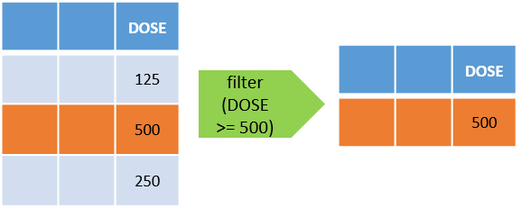
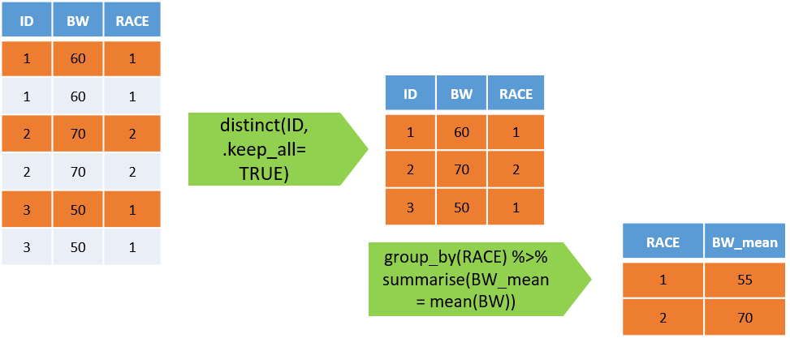
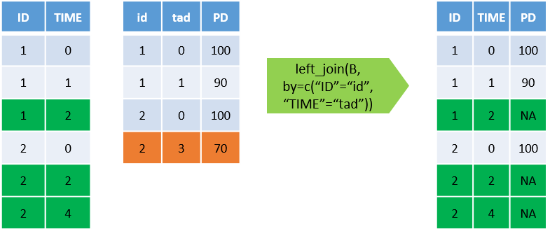
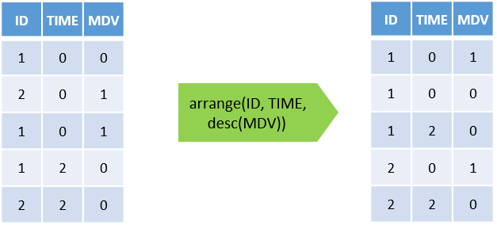

```{r setup, include=FALSE}
# install.packages("knitr")
# install.packages("tidyverse")
# install.packages("dplyr")

library(knitr)
library(tidyverse)
library(dplyr)
library(flextable)
library(png)
library(officer)
#library(DT)
Sys.setlocale('LC_ALL','C')

knitr::opts_chunk$set(echo = TRUE, warning = FALSE)

#path <- "/cloud/project" #default
#path <- "F:/Desktop/Rpmx/R-for-PMx"               # enviroment - 1
path <- "C:/Users/Sasaki.Tomohiro/Desktop/R-for-PMx"  # enviroment - 2
```

# Exploratory Data Analysis (EDA)
このセクションでは母集団薬物動態解析時のExploratory Data Analysis （EDA：探索的データ解析）について，
Rのコーディング技術を学びながら，習得していきます。

\pagebreak

## Contents
  - [Exploratory Data Analysis (EDA) とは](#EDA)
  - [Data Handling <“dplyr”>](#DHL)
    - 必要なスキルの説明-1：[データの読み込み](#DREAD)，[表示，計測](#DSHOW)，[抜き出し，要約](#DCOUN)
    - [演習-1](#EX-1)
    - 必要なスキルの説明-2：[データの結合，並び替え，整形](#DJOIN), [その他](#DOTH)
    - [演習-2](#EX-2)
  - [Data Visualization <“ggplot2”>](#VDAT)
    - 必要なスキルの説明-3：[基本設定](#GBASE)，[要約・分割](#GSUM)，[箱ひげ図，ヒストグラム](#GHIS)，[Formatting](#GFORM)
    - [演習-3](#EX-3)
  - [便利な機能](#UFUNC)
    
本日の概要になります。EDAとは何かを簡単に例を示しながら説明した後，主に二つのスキルについて，
学んでいきます。
1つ目はData Handling，二つ目はData Visualizationになります。
それぞれで必要なR coding スキルを説明した後，簡単な演習を行って頂きます。
演習はtotalで3つ予定していますが，時間の都合上1つは省略するかもしれません。

\pagebreak

## Exploratory Data Analysis (EDA) {#EDA}
  - 解析の前にデータの概要/傾向を把握する（可視化による一時分析）
    - 解析対象となる変数の平均推移の形，個別推移の形，外れ値/異常値の有無，PK/PDの相関確認
    - 共変量の分布，相関，外れ値/異常値の有無
  
  - 解析データセットに対して，以下を行う
    - 興味の対象ごとの要約統計量の算出（N, mean, median, min, maxなど）
    - 探索的なグラフ作成
    
まず，EDAについて，その概要を説明いたします。
EDAの大きな目的は解析の前にデータの概要/傾向を把握する事です。
最近発出された曝露反応解析のガイドラインでは可視化による一時分析とも呼ばれています
ので，これ自体（つまりデータの概要/傾向を把握する事）が一つの解析とも言えるもしれません。
具体的には解析対象となる変数（例えば血中濃度，薬効指標）に対しては，
解析対象となる変数の平均推移の形，個別推移の形，外れ値/異常値の有無，PK/PDの相関確認 などが確認する内容になります。
また，共変量については，その分布，相関，外れ値/異常値の有無を確認することになります。
共変量については，本日の3セクション目でも演習いたします。
これらを行うためには，解析データセットを用いて，興味の対象ごとの要約統計量を算出したり，
見たいグラフを作成出来るようになる必要があります。
このセクションではこれらが自在に出来るようになれるように演習を行います。

\pagebreak

### EDA Example
次にEDAの具体的な例を見ていきます。
こちらでは連続共変量（年齢，体重，身長，クレアチニンクリアランス）について，
試験ごとの要約統計量をまとめています。

```{r EDA_Example_1}
nm_data_ex <- read_csv(paste0(path, "/Data/PSP4-8-748-s012.csv"), na=".",
                    col_types = cols(C     = col_character(),
                                     TREAT = col_character())
                    )
nm_stats <- nm_data_ex %>% filter(PN <= 4) %>% group_by(ID) %>% slice(1) %>%
  mutate_at(c("WT", "AGE", "CRCL", "HT"), ~as.double(gsub(., pattern=-99, replacement = NA))) %>% 
  group_by(PN) %>% 
  summarise_at(c("WT", "AGE", "CRCL", "HT"),
              list(~length(which(!is.na(.))), ~min(., na.rm = TRUE), 
                   ~max(., na.rm = TRUE), ~mean(., na.rm = TRUE), 
                   ~sd(., na.rm = TRUE), ~median(., na.rm = TRUE))) %>% 
  mutate_if(is.double, ~signif(., 3)) %>% 
  gather(val=Value, key=Key, -PN) %>% 
  separate(Key, c("Covariate", "Stats"), "_") %>% 
  spread(key=Stats, value=Value) %>% 
  mutate(Covariate = factor(Covariate, levels = c("AGE", "WT", "HT", "CRCL"))) %>% 
  arrange(Covariate, PN) %>%
  select(Covariate, PN, length, median, min, max) %>% 
  # group_by(Covariate, PN) %>% 
  # summarise(N = n,
  #           `Median[Range]` = paste0(median, " [", min, "-" , max, "]")) %>% 
  rename(`Protocol No.` = PN,
         N              = length) %>% 
  flextable() %>%
  merge_v(part = "body") %>%
  merge_h(part = "body") %>%
  theme_box() %>% 
  font(fontname="Times New Roman", part = "all") %>%
  fontsize(size=10, part = "all") %>%
  align(align = "left", part="all") 

nm_stats
```
この表を見てみると，以下の2点に気づくかと思います。

  - Study No=3, 4では身長が入っていない
  - Study No=3, 4で異常に高いCRCLが存在する

すると，解析をする前にこれらに対して，どう対処するか検討する必要があることに気づきます。

次の例は図を作成する例になります。

```{r EDA_Example_2, warning=FALSE}
# indiv. Mean plot for selected trials
ggplot(data=nm_data_ex %>% filter(DRUG==2 & PN==19), 
       aes(x=RNTM, y=CONC)) + 
  geom_line(aes(group=ID), colour="darkgray") +
  stat_summary(colour="red") + stat_summary(geom = "line", colour="red") + 
  facet_grid(PERD~DOSE)  + scale_colour_discrete(name="Dose (mg)") + 
  xlab("Time after dose(hr)") + ylab("Plasma concentration (ng/mL)")
```

この図では用量ごと，投与期ごとの平均の血中濃度推移を個別の濃度推移を併せて，
示しています。
吸収相に着目すると，この化合物は最初の測定点でCmaxになっており，吸収が比較的早く，
複雑な吸収モデルは必要なさそうに見えます。
一方で，2期目で2例にsecondary peakが認められることに気づきます。
すると，この化合物の特性（例えば難溶性で，食事による吸収性が上がる）や試験デザインによる影響を考えると共に，
サンプルの取り違えなど，何かエラーがないか考えることになると思います。
さらに，軸を対数軸とすることで，どのようなコンパートメントモデルがデータに合いそうかヒントを得ることも出来きます。

```{r EDA_Example_3, warning=FALSE}
# indiv. Mean plot for selected trials
ggplot(data=nm_data_ex %>% filter(DRUG==2 & PN==19), 
       aes(x=RNTM, y=CONC)) + 
  geom_line(aes(group=ID), colour="darkgray") +
  stat_summary(colour="red") + stat_summary(geom = "line", colour="red") + 
  facet_grid(PERD~DOSE)  + scale_colour_discrete(name="Dose (mg)") + 
  xlab("Time after dose(hr)") + ylab("Plasma concentration (ng/mL)") %>% 
  scale_y_log10()
```

\pagebreak

## Data Handling {#DHL}

では，まずはデータハンドリングについて，Rのコーディングスキルを示しながら，学んでいきます。
データハンドリングでは

  - データの読み込み，整形，集計を行い，目的とする出力を作成する
  - グラフ作成の前処理としても必要なことが多い

です。
このデータハンドリングでは，主に二つのR package (“readr”, “dplyr”)を用います。
なお先ほどのセッションでもありましたが，R studioのcheatsheet（Data Import Cheatsheet, Data Transformation Cheatsheet）が非常に分かりやすいです。

https://rstudio.com/resources/cheatsheets/

\pagebreak

### データの読み込み, read_csv, read_table, paste, paste0 {#DREAD}

データの読み込み

  - **read_csv**, **read_table**: csv (コンマ区切り), txt形式（スペース or tab区切り）のファイルを読み込む
    - 自動でデータの型（double, character..等）を特定するが，うまく認識してくれないケースがある

文字列の結合

  - **paste0**: 文字列を結合する際に間に何も入れない
  - **paste**: 文字列を結合する際に間にスペースを入れる（default, 変更可能）

まずはpaste0でフォルダへのパスを結合して，read_csvで読み込みます。

```{r data-import-ex1}
#paste0で結合した文字列で指定したファイルをcsv形式で読み込みnm_data_ex1として格納
nm_data_ex1 <- read_csv(paste0(path, "/Data/PSP4-8-748-s012.csv")) 
```

ここではRがデータからデータ形式を推測して読み込んでいます。
次に一部のカラム形式を指定したデータを読み込んでみます。
また，データ中に現れる（ピリオド（.）について，NAとするように読み込みます。

```{r data-import-ex2}
# paste0で結合した文字列のファイルをcsv形式で読み込みnm_data_ex2として格納
# na=“.”: .(ピリオド)の値をNAとみなす⇒誤ってcharacterと認識されることを避ける
# col_typeで特定の行の型を指定する
nm_data_ex2 <- read_csv(paste0(path, "/Data/PSP4-8-748-s012.csv"), na=".",
                    col_types = cols(C     = col_character(),
                                     TREAT = col_character())
                    )
```

データの型指定の例：

  - col_character(): 文字列
  - col_integer(): 整数
  - col_double(): 実数
  - col_logical(): TRUE or FALSE
  - col_date(format = ""): 日付
  - col_time(format = ""): 時間
  - col_datetime(format = ""): 日付
  - col_guess(): 推測する
  - col_skip(): 列を読まない

最後に**read_table**を使ってtxt形式のデータを読み込む場合の例を以下に示します。
NONMEMの出力Tableでは最初の一行は不要であるため，読み飛ばします（skip=1）

```{r data-import-ex3}
# paste0で結合した文字列のファイルをtxt形式で読み込みnm_dataとして格納
# skip=1で最初の1行目を読み飛ばす
nm_data_ex3 <- read_table(paste0(path, "/Data/sdtab60"), na=".", skip=1)
```

\pagebreak

### データの表示，head, View, names, count, n, nrow, ncol {#DSHOW}

続いて読み込んだデータを表示していきます。意図したとおりにデータが読み込めているかの確認を行います。
以下に良く用いる関数を挙げています。


データの表示

  - **head**: データの最初の5行（default）を表示
  - **View**: データをスプレッドシートとして表示
  - **names**: データの列名を表示
  
```{r head-Ex}
nm_data <- read_csv(paste0(path, "/Data/PSP4-8-748-s012.csv"), na=".",
                    col_types = cols(C     = col_character(),
                                     TREAT = col_character())
                    )
# nm_dataの最初の10行を表示
head(nm_data, 10)
```
  
```{r view-Ex}
# nm_dataをスプレッドシートとして表示
View(nm_data)
```

```{r names-Ex}
names(nm_data)
```

\pagebreak

さらに読み込んだデータのカウント（計測）を行っていきます。
基本的には行数又は列数を計測する関数になります。
これは次のセクションで説明するデータの抜き出し，要約と組み合わせて使うことが多いです。

データの計測

  - **count**, **nrow**: データの行数を計測，countでは()内の変数でグループ化して計測する
  - **ncol**: データの列数を係数


```{r count-EX}
# nm_dataの行数計測
nm_data %>% nrow()
# nm_dataの行数をPNごとに計測
nm_data %>% count(PN)
# nm_dataの列数を計測
nm_data %>% ncol()
```

\pagebreak

### データの抜き出し,要約 filter, slice, group_by, summarise {#DCOUN}
ここではデータを抜き出し，要約するスキルを学びます。前半部分のコアとなるところかと思います。

データの抜き出し

  - **filter**: ()内の条件式に該当する行を抜き出す
  - **slice**: ()内の行数だけ行を取り出す
  - **distinct**: ()内の変数の重複を削除する, .keep=allを指定しないと，その変数だけになる



```{r filter-Ex}
# nm_dataのDOSEが500以上の行を抜き出す
nm_data %>% filter(DOSE >= 500)

# nm_dataのDOSEが500以上かつRACEが1の行を抜き出す
nm_data %>% filter(DOSE >= 500 & RACE == 1)
```

```{r slice-distinct-Ex}
# nm_dataの最初の2行を取り出す
nm_data %>% slice(2)

# nm_dataのIDの重複を取り除く
nm_data %>% distinct(ID)

# nm_dataのIDの重複を取り除く(他の変数も残す)
nm_data %>% distinct(ID, .keep_all = TRUE)

```

条件式の例

  - A == B : AがBと等しい 
  - A != B  : AがBと異なる 
  - A <= B : AがB以下
  - A >= B : AがB以上
  - A < B   : AがB未満
  - A > B   : AがBより大きい
  - A %in% c(B, C, D) : AがB, C, Dに含まれる
  - A == B & C == D : AがBと等しくかつCがDと等しい
  - A == B | C == D : AがBと等しい又はCがDと等しい

\pagebreak

データの要約

  - **group_by**: 以降の処理を()内ごとに行う
  - **ungroup**: groupごとの処理を解除する
  - **summarise**: group_byでgroupingした列ごとに新たな列を作る



```{r group-summarize-Ex}
# nm_dataのIDごとに最初の1行抜き出し，RACEごとにBWの平均値を求める
nm_data %>% distinct(ID, .keep_all = TRUE) %>% group_by(RACE) %>% summarise(BW_mean = mean(WT))
```

要約統計量の関数例

  - **length** : 数
  - **mean** : 平均 
  - **sd**   : 標準偏差
  - **median**  : 中央値 
  - **min** : 最小値
  - **max** : 最大値
  - **quantile(,prob=X)** : 100*Xのパーセント点

\pagebreak

### 演習-1 {#EX-1}

data folder内のPSP4-8-748-s012.csvをnm_data2として読み込み，

  1. 試験（PN）ごとの被験者数(ID)
  2. 試験（PN）ごとのMK7655(DRUG=2)の有効血漿中濃度の数（MDV=0の行数）
  3. PN = 1, 2のデータに絞り，試験（PN）ごとかつ用量（DOSE）ごとの背景因子（AGE, WT, CRCL）の平均値
  
を算出してください

```{r Ex-1}
## ここに回答を入力して，実行してみてください

```

```{r Ex-1-Answer}
# 演習-1の回答です --------------------
## Read dataset
nm_data2 <- read_csv(paste0(path, "/Data/PSP4-8-748-s012.csv"), na=".",
                     col_types = cols(C     = col_character(),
                                      TREAT = col_character() 
                                      ))

## Number of Subject by PN
nm_data2 %>% distinct(PN, ID) %>% group_by(PN) %>% count() 

## Number of MK7655 Vaid Concentration Record by PN
nm_data2 %>% filter(MDV == 0 & DRUG == 2) %>% group_by(PN) %>% count() 

## Number of Subject and MK7655 Vaid Concentration Record by PN
nm_data2 %>% group_by(PN) %>% summarise(N_Sub  = length(unique(ID)),
                                        N_Conc = length(CONC[MDV == 0 & DRUG == 2])) 

## Desc. Stats. Grouped by PN and Dose
nm_data2 %>% filter(PN <= 2) %>% group_by(PN, DOSE) %>% summarise(Age_Mean  = mean(AGE),
                                                                  WT_Mean   = mean(WT),
                                                                  CRCL_Mean = mean(CRCL))

```

\pagebreak

### データの結合，並び替え，整形 left_join, bind_rows, arrange {#DJOIN}
ここでは他のデータの結合，並び替え，整形についてのスキルを紹介します。

  * **left_join** : データの左側に別のデータを結合(マージする)
    + byで結合のためのKeyを指定（複数可能），Key名が異なる場合は対応関係を記載
    + 他にも結合の関係を逆にする(**right_join**)，一致する行だけ残す(**inner_join**), 全て残す(**full_join**)というものもある
  * **bind_rows** : データの下側から別のデータを結合する
    + 順序に関わらず列名が同じところに結合する
    + 結合する列名がないと，NAを返す
  * **arrange** : データを()で指定した列の昇順に並び替える
    + 複数指定可，降順に指定する場合は**desc()**
  * **select** : 指定した列のみ残す（削る）



```{r Join-Ex}
# 結合するデータの読み込み
nm_data_ibw <- read_csv(paste0(path, "/sample/1_data_handling/nm_data_ibw.csv"))

# nm_dataにnm_data_ibwをIDで紐づけして結合する
nm_data %>% left_join(nm_data_ibw, by="ID")

# nm_dataにnm_data_ibwをID, TIME(="time")で紐づけして結合する
nm_data %>% left_join(nm_data_ibw, by=c("ID", "TIME"="time"))

# 結合するデータの作成
nm_data_br <- nm_data %>% filter(TIME == 0)
# nm_dataの下にnm_data_brを結合する
nm_data %>% bind_rows(nm_data_br)
```



```{r Arrange-Select-Ex}
# nm_dataをID, TIME, MDV(降順) に並び替える
nm_data %>% arrange(ID, TIME, desc(MDV))

# nm_dataのID, DOSE, RACEのみを残す
nm_data %>% select(ID, DOSE, RACE)

# nm_dataのWTを削る
nm_data %>% select(-WT)

```

\pagebreak

### その他よく使う関数 mutate, expand.grid, sample_n {#DOTH}

その他，data handlingで良く使う関数を挙げます。

  - **mutate** : 新たな列を作成する
  - **expand.grid** : 全ての組み合わせから成るデータを作成
  - **sample_n** : データから（）の行をランダムに取り出す
    * replace=TRUEとすると復元抽出とする
    * 結果に再現性を残したい場合実行前にset.seed(任意の値)と書く

```{r Other-Ex}
# nm_dataに新たにIBW(=22*(HT/100)^2)という列を作成
nm_data %>% mutate(IBW = 22 * (HT/100)^2)

# nm_dataに新たにIBWという列を作成(性別で式を変える)
nm_data %>% mutate(ifelse(MALE == 0, 50 + 0.91*(HT-152.4), 45.5 + 0.91*(HT-152.4)))

# ID=1~10について，TIME＝1~24の列を持つデータを作成し，tibble形式にして，nm_data_eに格納する
nm_data_e <- expand.grid(ID = 1:10, TIME=1:24) %>% as_tibble()

# nm_dataをそれぞれID一行ずつにして，1000行ランダムに復元抽出する
nm_data %>% distinct(ID, .keep_all = TRUE) %>% sample_n(1000, replace=TRUE)

```

\pagebreak

### 演習-2 {#EX-2}

data folder内のPSP4-8-748-s012.csvをnm_data2, back_info.csvをback_infoとして読み込み，
  
  1. nm_data2にback_infoをIDをKeyとしてマージしてください
  2. CYP2D6 Phenotypeごとの被験者数を算出してください

```{r Ex-2}
## ここに回答を入力して，実行してみてください

```

```{r Ex-2-Answer}
# 演習-2の回答です
## Read dataset
nm_data2 <- read_csv(paste0(path, "/Data/PSP4-8-748-s012.csv"), na=".",
                     col_types = cols(C     = col_character(),
                                      TREAT = col_character() 
                                      ))
back_info <- read_csv(paste0(path, "/Data/back_info.csv"), na=".")

## Merge dataset & count ID by CYP2D6
nm_data2 %>% left_join(back_info, by="ID") %>% distinct(ID, .keep_all = TRUE) %>% group_by(CYP2D6) %>% count()

```

\pagebreak

## Data Visualization {#VDAT}
次のセクションではData Visualization，データの可視化について学んでいきます。

  * データを元に図を作成し，目的とする確認を可視的に行う
  * R package “ggplot2” を用いる
    + R studioのcheatsheet（Data Visualization Cheatsheet）が非常に分かりやすい
    
 https://rstudio.com/resources/cheatsheets/

\pagebreak

### ggplot2の基本ggplot, geom_point, geom_line {#GBASE}
まずは基本的なggplotのcodingルールを理解し，散布図と折れ線グラフを作成してみます。

  - **ggplot**: 以降のdefault設定（ex: 用いるデータ，x, yに使うデータ）を定義する
    + データ中の列を使用する場合，aes()を用いる
    + これを設定して実行しても何も作成されない（枠のみ）
    + groupで指定した値ごとにプロットする
    + colourで指定した値ごとに色を分ける
  - **geom_point**: 散布図を作成する
  - **geom_line**: 折れ線グラフを作成する

順に例を見ながら説明していきます。

```{r ggbase-Ex}
## プロットに使うデータ（nm_dataの一部）
nm_data_p <- nm_data %>% filter(PN==19 & DRUG==2 & MDV==0 & PERD == 1)

# nm_dat_pを使い，xにTIME，yにCONCの列を用いる。IDごとにプロットし，MALEごとに色を分ける。
# この時点では枠だけ，何も出ない
ggplot(data=nm_data_p, aes(x=TIME, y=CONC, group=ID, colour=MALE))

# 同上, 別の書き方
nm_data_p %>% ggplot(aes(x=TIME, y=CONC , group=ID, colour=MALE))

```

この時点では枠だけで何も出ないですが，ここに散布図**geom_point**を加えます。
    
```{r geom_point-Ex}
# nm_data_pを使い，xにTIME，yにCONCの列を用いる。IDごとにプロットし，MALEごとに色を分けた散布図を作成する。
nm_data_p  %>% ggplot(aes(x=TIME, y=CONC, group=ID, colour=MALE)) + geom_point()

# nm_data_pを使い，xにTIME，yにCONCの列を用いる。IDごとにプロットし，factorに変換したMALEごとに色を分けた散布図を作成する。
nm_data_p  %>% ggplot(aes(x=TIME, y=CONC, group=ID, colour=factor(MALE))) + geom_point()

```

同様に折れ線グラフを作る場合は**geom_line**を使います。

```{r geom_line-Ex}
# nm_data_pを使い，xにTIME，yにCONCの列を用いる。IDごとにプロットし，MALEごとに色を分けた折れ線グラフを作成する。
nm_data_p  %>% ggplot(aes(x=TIME, y=CONC, group=ID, colour=factor(MALE))) + geom_line()

```

\pagebreak

### 要約，分割してプロット stat_summary, stat_smooth, facet_wrap/grid {#GSUM}

次に要約と分割を利用したプロット方法を示します。

  * 要約
    + **stat_summay** : 要約統計量を算出し，プロットする
      - funで算出する統計量を指定（デフォルト：mean ±SE を算出）
      - geomで何を表示するか指定（デフォルト：”point”）
    + **stat_smooth** : 回帰直線/平滑化曲線をプロットする
      - methodで算出する方法を指定（デフォルト：データ数に応じて自動で判断）
        * methodのオプション：“loess”, “glm”, “lm”, “gam”
  * 分割
    + **facet_wrap** : 指定した変数ごとに図を分割する
      - scalesで縦/横軸のスケール調整が可能
    + **facet_grid** : 指定した変数ごとに図を縦横に分割する
      - scalesで縦/横軸のスケール調整が可能

データを要約してプロットする二つの関数例（stat_summary, stat_smooth）を示します。

```{r Sum-Ex}
## stat_summary
# nm_dat_pを使い，xにTIME，yにCONCとして，MALEごとに色分けして平均 ± SEをプロットする
ggplot(data=nm_data_p, aes(x=TIME, y=CONC, colour=factor(MALE))) + stat_summary()

# nm_dat_pを使い，xにTIME，yにCONCとして，MALEごとに色分けして中央値をプロットし，線で結ぶ
ggplot(data=nm_data_p, aes(x=TIME, y=CONC, colour=factor(MALE))) + stat_summary(fun=median) + 
stat_summary(fun=median, geom="line")

## stat_smooth
# nm_dat_pを使い，xにTIME，yにCONCとして，MALEごとに色分けして平滑化曲線を作成する
ggplot(data=nm_data_p, aes(x=TIME, y=CONC, colour=factor(MALE))) + stat_smooth()

```

データを分割してプロットする二つの関数例（facet_wrap, facet_grid）を示します。
**facet_wrap**では基本的には1つの変数でパネルを分ける，**facet_grid**では二つの変数で縦/横にパネルを分ける場合に用います。

``` {r Fac-Ex}
## facet_wrap
ggplot(data=nm_data_p, aes(x=TIME, y=CONC, colour=factor(MALE))) + geom_line() + facet_wrap(~ID, scales = "free")
ggsave("1_data_handling/facet_wrap.png", width=10, height = 8)

## Data to plot both drug=1&2
nm_data_p2 <- nm_data %>% filter(PN==19 & MDV==0 & PERD == 1)

## facet_grid
ggplot(data=nm_data_p2, aes(x=TIME, y=CONC, colour=factor(MALE))) + geom_line(aes(group=ID)) + facet_grid(DRUG~MALE, scales="free")
ggsave("1_data_handling/facet_grid.png", width=10, height = 8)

```

\pagebreak

### 箱ひげ図，ヒストグラムgeom_boxplot, geom_histogram {#GHIS}

もう少し図のバリエーションを学びましょう。箱ひげ図とヒストグラムです。

  * **geom_boxplot** : 箱ひげ図の作成
  * **geom_histogram** : ヒストグラムの作成
    + binwidthでbinの幅を設定
    + fillで変数ごとに色分け
    + position=“identity”で重ねて表示

```{r hist-Ex}
## Data to plot
nm_data_b <- nm_data %>% group_by(ID) %>% slice(1) %>% ungroup()

## geom_boxplot
# nm_dat_bを使い，xをfactor化したPN，yにCRCLとして，箱ひげ図を作成
nm_data_b %>% ggplot() + geom_boxplot(aes(x=factor(PN), y=CRCL))

## geom_histogram
# nm_dat_bを使い，CRCLのヒストグラムを作成
nm_data_b %>% ggplot() + geom_histogram(aes(x=CRCL))

# nm_dat_bを使い，PNで色分けしてCRCLのヒストグラムを作成
nm_data_b %>% ggplot() + geom_histogram(aes(x=CRCL, fill=factor(PN)), position = "identity", alpha = 0.5, binwidth = 10)

```

\pagebreak

### 図のFormatting xlab, ylab, ggtitle, theme… {#GFORM}

最後に図のFormattingについてです。これは本質的には重要ではないのですが，
図をきれいに見せるには必要な設定になります。
細かい説明は省略しますが，実際に書き換えてプロットしてみると，
どこの設定を指しているか分かりやすいと思います。

```{r format-Ex}
## Data to plot both drug=1&2
# plotするデータの絞り込み
nm_data_p2 <- nm_data %>% filter(PN==19 & MDV==0 & PERD == 1)

## facet_grid
ggplot(data=nm_data_p2, aes(x=TIME, y=CONC, colour=factor(MALE))) + geom_line(aes(group=ID)) + 
  facet_grid(DRUG~MALE, scales="free") + 
  xlab("Time after dose(hr)") + ylab("Plasma Concentration (ng/mL)") + # 軸名
  scale_x_continuous(breaks = seq(0, 10, by=2)) +                      # x軸の目盛りの切り方（y軸も同様に設定可能, scale_y_continuous）
  scale_colour_discrete(name = "Sex (0=Female, 1=Male)") +             # legend title
  ggtitle("Plasma Concentration Profiles by Sex", subtitle = "Only PN=19 data used") +  # 図のtitle，subtitle
  labs(caption = paste0("Y panel: 1=Imipenem, 2=MK7655, X panel: 0=Female, 1=Male\n",   # 図のfootnote
                        "Source: ", path, "/Data/PSP4-8-748-s012.csv"
                        )
       ) +
  theme_bw() +   # 図のスタイル，theme_classic(), theme_light()など
  theme(axis.text= element_text(size=10),     # 軸のTick名のフォント
        axis.title = element_text(size=10),   # 軸名のフォント
        legend.title = element_text(size=10), # legend titleのフォント
        legend.text = element_text(size=10),  # legend のフォント
        legend.key.size = unit(0.3, "cm"),    # legend のサイズ
        plot.title= element_text(size=15, face="bold"),  # 図のtitle のフォント
        plot.subtitle = element_text(size=10),           # 図のsubtitle のフォント
        plot.caption = element_text(size=8, colour="black", hjust = 1.0), # 図のfootnote のフォント
        strip.text=element_text(size=10),  # 分割図の割り当て名のフォント
        legend.position = "top")           # legendの位置, “left”, “top”, “right”, “bottom”, 座標表示(ex. c(0.9, 0.1))

```

\pagebreak

### 演習-3 {#EX-3}

data folder内のPSP4-8-748-s012.csvをnm_data3として読み込み，以下を作図してください。

  1. PN=2のデータについて，個別濃度推移とその平均推移を重ね合わせた図を薬剤（DRUG）ごとに作成してください
  2. 全症例のデータについて，体重とCRCLの相関プロットを近似曲線付きで示してください。

```{r EX-3}
## ここに回答を入力して，実行してみてください
```

```{r Ex-3-Answer}
# 演習-3の回答です --------------------
## Data to plot 
nm_data_ex3 <- nm_data %>% filter(PN==2 & MDV==0)

## By Drug
nm_data_ex3 %>% ggplot(aes(x=RNTM, y=CONC)) + geom_line(aes(group=ID), colour="darkgray") + stat_summary(colour="red") +
  stat_summary(geom="line", colour="red") + facet_wrap(~DRUG, scales = "free")

## BW-CLCR
nm_data %>% filter(CRCL>0) %>% group_by(ID) %>% slice(1) %>% ggplot(aes(x=WT, y=CRCL)) + geom_point(colour="darkgray") + stat_smooth() + theme_bw()

```

\pagebreak

## 便利な機能 {#UFUNC}

ここでは知っていると便利な機能をおまけ的に紹介します。

### Tableの整形 flextable

flextableはきれいにTableを作成するパッケージになります。
作成したTableをそのまま出力して，提示できます。

  - **flextable**: Tableの整形が出来るパッケージ

```{r flextable}
## Desc. Stats. Grouped by PN and Dose
nm_flex <- nm_data2 %>% filter(PN <= 2) %>% group_by(PN, DOSE) %>% summarise(Age_Mean  = mean(AGE), # 演習-1の回答
                                                                  WT_Mean   = mean(WT),
                                                                  CRCL_Mean = mean(CRCL)) %>% 
  mutate_if(is.double, ~signif(., 3)) %>%  # 有効桁数を揃える
  flextable() %>%                          # flextableへ変換
  merge_v(part = "body") %>%               # 横軸で同じ値を結合
  merge_h(part = "body") %>%               # 縦軸で同じ値を結合
  theme_box() %>%                          # themeの設定
  font(fontname="Times New Roman", part = "all") %>% # フォントの設定
  fontsize(size=10, part = "all") %>%      # フォントサイズの設定
  align(align = "left", part="all") %>%    # 文字を左揃えにする
  width(width = 0.8)                       # カラム幅を設定

nm_flex

```

### 帳票のword/ppt出力 officer

Rで作成した図表をそのままwordやpptに出力できます。

  - **officer**: 作成したtable, figureをwordやpptに出力できるパッケージ

``` {r officer}
## word export
doc <- read_docx() %>%
  body_add_par(value = "EDA Table", style = "heading 2") %>% # 表タイトルの設定
  body_add_flextable(value = nm_flex) %>% # 作成したflextableをセット
  print(target = "1_data_handling/Officer_Table.docx") #  word fileとして出力

## ppt export
ppt <- read_pptx() %>% 
  add_slide(layout = "Title and Content") %>%
  ph_with(value = "EDA Table", location = ph_location_type(type = "title")) %>% # pptタイトルの設定
  ph_with(nm_flex, location = ph_location_type(type = "body")) %>% # 作成したflextableをセット
  print(target = "1_data_handling/Officer_Table.pptx") #  ppt fileとして出力

```

# End of document